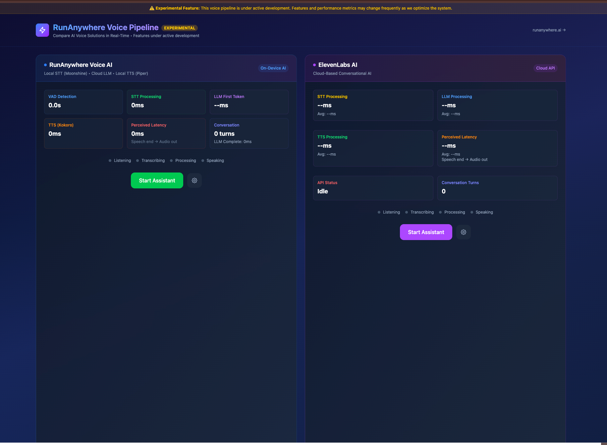

# RunAnywhere Voice Pipeline

Ultra-low latency voice AI conversations in your browser - ~50% faster than ElevenLabs.



## About RunAnywhere

[RunAnywhere](https://www.runanywhere.ai/) is building the future of local AI inference, making powerful AI models run efficiently on any device. This voice pipeline demonstrates our commitment to high-performance, privacy-preserving AI that runs directly in your browser.

Check out our [SDKs and tools](https://github.com/RunanywhereAI/runanywhere-sdks) for more ways to run AI locally.

## What We Built

A complete end-to-end voice AI pipeline with ultra-fast response times:
- **Moonshine STT** → **OpenAI LLM** → **Kokoro TTS**
- Fully local speech recognition and synthesis
- ~50% faster than ElevenLabs cloud pipeline
- Side-by-side comparison mode for benchmarking
- Comprehensive performance metrics at every stage

## Key Features

- Ultra-low latency conversational AI
- WebGPU/WebAssembly acceleration  
- Voice Activity Detection with echo prevention
- 16 voice options (Kokoro) or native browser TTS
- Progressive Web App (works offline)

## Credits

Built on top of amazing open source projects:
- Original [Whisper Web](https://github.com/xenova/whisper-web) by Xenova
- Enhanced fork by [Pierre Mesure](https://github.com/PierreMesure/whisper-web)
- [Transformers.js](https://github.com/xenova/transformers.js) for WebAssembly ML
- [Moonshine STT](https://github.com/usefulsensors/moonshine) models
- [Kokoro TTS](https://huggingface.co/hexgrad/Kokoro-82M) by hexgrad

For technical details, see [Voice Pipeline Architecture](./docs/VOICE_PIPELINE_ARCHITECTURE.md).

## Running locally

1. Clone the repo and install dependencies:

    ```bash
    git clone https://github.com/PierreMesure/whisper-web.git
    cd whisper-web
    npm install
    ```

2. Run the development server:

    ```bash
    npm run dev
    ```

3. Open the link (e.g., [http://localhost:5173/](http://localhost:5173/)) in your browser.
